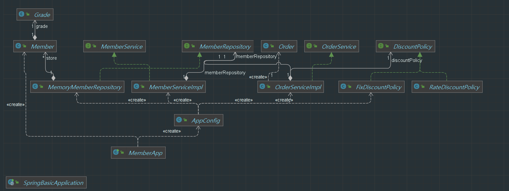

### **IoC(제어의 역전, Inversion of Control)**
- 기존 프로그램들은 구현 객체가 스스로 객체를 생성하고 연결하며 실행했다. 구현 객체가 프로그램의 제어 흐름을 조종했다.
```java
public class AppConfig {
    public MemberRepository memberRepository() {
        return new MemoryMemberRepository();
    }
    public DiscountPolicy discountPolicy() {
        return new FixDiscountPolicy();
    }
    public MemberService memberService() {
        return new MemberServiceImpl(memberRepository());
    }

    public OrderService orderService() {
        return new OrderServiceImpl(memberRepository(), discountPolicy());
    }
}
```

```java
public class OrderServiceImpl implements OrderService{
    private final MemberRepository memberRepository;
    private final DiscountPolicy discountPolicy;

    public OrderServiceImpl(MemberRepository memberRepository, DiscountPolicy discountPolicy) {
        this.memberRepository = memberRepository;
        this.discountPolicy = discountPolicy;
    }

    @Override
    public Order createOrder(Long memberId, String itemName, int itemPrice) {
        Member member = memberRepository.findById(memberId);
        int discountPrice = discountPolicy.discount(member, itemPrice);

        return new Order(memberId, itemName, itemPrice, discountPrice);
    }
}
```
- 하지만 `AppConfig`를 설정한 이후, 구현 객체는 자신의 로직을 실행하는 역할만 담당한다. 프로그램의 제어의 흐름은 `AppConfig`가 담당하는 것이다. 위 코드, `OrderServiceImpl`은 필요한 인터페이스들을 호출하지만 어떤 구현 객체들이 실행될 지 모른다.
- 프로그램에 대한 제어의 흐름에 대한 권한은 모두 `AppConfig`가 가지고 있으며, 심지어 `OrderServiceImpl` 객체도 `AppConfig`가 생성한다. 
- 프로그램의 제어의 흐름을 직접 제어하는 것이 아니라 외부에서 관리하는 것은 제어의 역전(IoC)이라 한다.

> 프레임워크 vs 라이브러리<br>
> 프레임워크가 내가 작성한 코드를 제어하고, 대신 실행하면 **프레임 워크**<br>
> 내가 작성한 코드가 직접 제어의 흐름을 담당한다면 **라이브러리**

### **DI(의존관계 주입, Dependency Injection)**
- `OrderServieImpl`은 `DiscountPolicy`인터페이스에 의존한다. 실제 어떤 객체가 사용될지는 모른다.
- 의존관계는 **정적인 클래스 의존 관계와, 실행 시점에 결정되는 동적인 객체(인터페이스) 의존 관계** 둘은 분리해서 생각해야한다.

- 애플리케이션 **실행시점(런타임)**에 외부에서 실제 구현 객체를 생성하고, 클라이언트에 전달하여 클라이언트와 서버의 실제 의존관계가 연결되는 것을 **의존관계 주입**이라 한다.
- 의존관계 주입을 사용하면 클라이언트 코드를 변경하지 않고, 클라이언트가 호출하는 대상의 타입 인스턴스를 변경할 수있다. 즉, 정적인 클래스 의존관계를 변경하지 않고 **동적인 객체 인스턴스 의존관계를 쉽게 변경할 수 있다.**

### **IoC 컨테이너, DI 컨테이너**
- `AppConfig`와 같이 객체를 생성하고 의존관계를 연결해주는 것을 IoC 컨테이너 또는 **DI 컨테이너**라 한다.
- 의존관계 주입에 초점을 맞추어 최근에는 DI 컨테이너라고 부르며, 어셈블러(어플리케이션 전체에 대한 구성을 조립한다는 의미), 오브젝트 팩토리 등으로 불린다.


### **Spring Container**
```java
@Configuration
public class AppConfig {
    @Bean
    public MemberRepository memberRepository() {
        return new MemoryMemberRepository();
    }
    @Bean
    public DiscountPolicy discountPolicy() {
//        return new FixDiscountPolicy();
        return new RateDiscountPolicy();
    }
    @Bean
    public MemberService memberService() {
        return new MemberServiceImpl(memberRepository());
    }
    @Bean
    public OrderService orderService() {
        return new OrderServiceImpl(memberRepository(), discountPolicy());
    }
}
```
```java
public class OrderApp {
    public static void main(String[] args) {
        ApplicationContext applicationContext = new AnnotationConfigApplicationContext(AppConfig.class);
        MemberService memberService = applicationContext.getBean("memberService", MemberService.class);
        OrderService orderService = applicationContext.getBean("orderService", OrderService.class);

        Long memberId = 1L;
        Member member = new Member(memberId, "김민지", Grade.VIP);
        memberService.join(member);

        Order order = orderService.createOrder(memberId, "붕어빵", 2000);

        System.out.println("order = " + order);
    }
}
```
- `ApplicationContext`를 Spring Container라 한다. 기존에는 개발자가 직접 `AppConfig`를 사용하여 객체를 생성하고 DI를 하였지만, Spring Container를 통해서 DI를 진행한다.
- Spring Container는 `@Configuration`이 붙은 `AppConfig`를 설정, 구성정보로 사용한다. `@Bean`이 붙은 메서드를 모두 호풀해서 **반환된 객체를 Spring Container**에 등록한다. 이렇게 Spring Container에 등록된 객체를 **Spring Bean**이라 한다.
- Spring Bean은 `@Bean`이 붙은 **메서드 명을 Spring Bean의 이름**으로 사용한다. 
- 이전에는 필요한 객체를 `AppConfig`를 사용해서 조회했지만, Spring Container를 통하여 Spring Bean을 찾아야한다. `applciationContext.getBean("Bean name", Bean.class)`를 이용하여 찾을 수 있다.