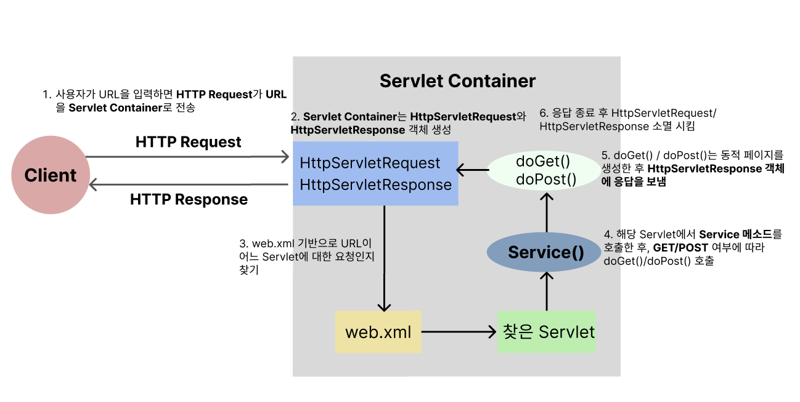

### **Spring Container? Servlet Container**?
#### Servlet이란?
- Servlet은 Java EE의 표준 중 하나로 javax.servlet Package를 기반으로 Server에서 동작하는 Class들을 의미한다.
- 클라이언트의 요청을 처리하고 그 결과를 반환하는 Servlet Class의 구현 규칙을 지킨 자바 웹 프로그래밍 기술이다. 웹 서버의 성능을 향상하기 위해 사용되는 자바 클래스의 일종이다.
- JSP와 비슷한 점이 있지만, JSP는 HTML 코드에 Java 코드를 포함하고 있는 반면 Servlet은 **자바 코드 안에 HTML 코드를 포함하고 있다**는 차이점이 있다.

> **Servlet** 간단 정리  
> - 클라이언트의 요청에 대해 동적으로 작동하는 웹 어플리케이션 컴포넌트
> - `HTML`을 사용하여 요청에 응답한다.
> - `Java Thread`를 이용하여 동작한다
> - MVC 패턴에서 Controller로 이용된다.
> - HTTP 프로토콜 서비스를 지원하는 `javax.servlet.http.HttpServlet` 클래스를 상속받는다.

토큰 정보를 받기위해 사용하던 `HttpServletRequest`는 Http 프로토콜의 request 정보를 Servlet에게 전달하기 위한 목적으로 사용되는 Class이며
Header정보, Parameter, Cookie, URI, URL 등의 정보를 읽어들이는 메소드를 가지고 있다. 

### Servlet 동작 방식

### Application Context와 Servlet Context
| Application Context                                                                                                                                                                                                                                                                                                                                                   | Servlet Context                                                                                                                                                                                                                                                                                     |
|:----------------------------------------------------------------------------------------------------------------------------------------------------------------------------------------------------------------------------------------------------------------------------------------------------------------------------------------------------------------------|:----------------------------------------------------------------------------------------------------------------------------------------------------------------------------------------------------------------------------------------------------------------------------------------------------|
| - Web Application 최상단에 위치하고 있는 Context  - Spring에서 ApplicationContext란 BeanFactory를 상속받고 있는 Context -> Spring에서 생성되는 Bean에 대한 IoC Container  - 특정 Servlet설정과 관계 없는 설정을 한다 (@Service, @Repository, @Configuration, @Component)  - 서로 다른 여러 Servlet에서 공통적으로 공유해서 사용할 수 있는 Bean을 선언한다.  Application Context에 정의된 Bean은 Servlet Context에 정의 된 Bean을 사용할 수 없다. | - Servlet 단위로 생성되는 Context  - 하나의 Servlet이 Servlet Container와 통신하기 위해서 사용되어지는 메서드들을 가지고 있는 클래스가 바로 ServletContext  - Spring에서 servlet-context.xml 파일은 DispatcherServlet 생성 시에 필요한 설정 정보를 담은 파일 (Interceptor, Bean생성, ViewResolver등..)  - URL설정이 있는 Bean을 생성 (@Controller, Interceptor)  |

> ### Application Context와 Servlet Context 간단 정리
> **Application Context**
> - 공통 기능을 할 수 있는 Bean 설정 (Service, Util 등..)
> - 각 Servlet에서 공유할 수 있는 Bean
> 
> **Servlet Context**
> - Servlet 구성에 필요한 Bean 설정 (Controller, Interceptor, Mapping Handler 등)

### ApplicationContext와 ServletContext의 life-cycle

참고자료: https://mangkyu.tistory.com/14